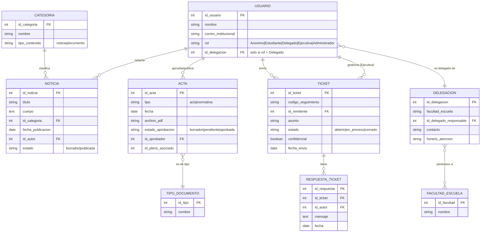

# Diagrama Conceptual y Arquitectura de Información — Portal CADUS

Modelo conceptual de datos que soporta los requisitos de información [RI-01 a RI-06](../requisitos/rem-remus/REM-CADUS.md#3-requisitos-de-información-ri-01-a-ri-06) de la especificación REM/REMUS.

## Diagrama entidad-relación

## Descripción de entidades

| Entidad | Requisito de información | Descripción |
|---|---|---|
| **Usuario/Rol** | RI-06 | Representa a cualquier persona con cuenta en el sitio (o al visitante anónimo). El rol determina las capacidades (ver RF-14). |
| **Noticia/Comunicado** | RI-01 | Contenido publicado, clasificado por categoría, con estado de borrador o publicada. |
| **Categoría** | RI-05 | Etiqueta temática reutilizable tanto para noticias como para documentos (actas/normativas). |
| **Acta/Documento** | RI-02 | Acta de pleno o normativa en PDF, sujeta al flujo de aprobación previa (RN-01) antes de su publicación. |
| **Delegación** | RI-03 | Ficha de la delegación de alumnos de una Facultad/Escuela, con su delegado responsable. |
| **Consulta/Ticket** | RI-04 | Consulta o reclamación enviada por un estudiante, con código de seguimiento único y nivel de confidencialidad. |

## Relaciones y reglas de integridad

- **Usuario → Noticia (1:N):** un usuario con rol Ejecutiva o Administrador puede redactar varias noticias; toda noticia tiene un único autor.
- **Categoría → Noticia (1:N):** una categoría puede clasificar múltiples noticias; una noticia pertenece a una única categoría (RF-01).
- **Usuario → Acta (1:N, "aprueba"):** solo un usuario con rol Ejecutiva puede cambiar el estado de un acta a `aprobada` (RN-01); un acta queda huérfana de aprobador mientras esté en estado `borrador` o `pendiente`.
- **Usuario ↔ Delegación (1:1, "es delegado de"):** un usuario con rol Delegado está asociado a como máximo una delegación; solo ese delegado o un Administrador pueden editar la ficha (RN-04).
- **Delegación ↔ Facultad/Escuela:** cada delegación se asocia a una única Facultad/Escuela del directorio (RF-06).
- **Usuario → Ticket (1:N, "envía"):** un estudiante puede enviar múltiples tickets; cada ticket tiene un único remitente, verificado por dominio institucional `@alum.us.es` (RN-02).
- **Ticket → Respuesta (1:N):** un ticket acumula un historial de respuestas; solo el remitente y miembros de la Ejecutiva pueden acceder al contenido si `confidencial = true` (RN-03).
- **Integridad referencial mínima:** no se permite eliminar una `Categoría`, `Delegación` o `Usuario` referenciados por contenido existente; se debe reasignar o archivar el contenido dependiente primero.
