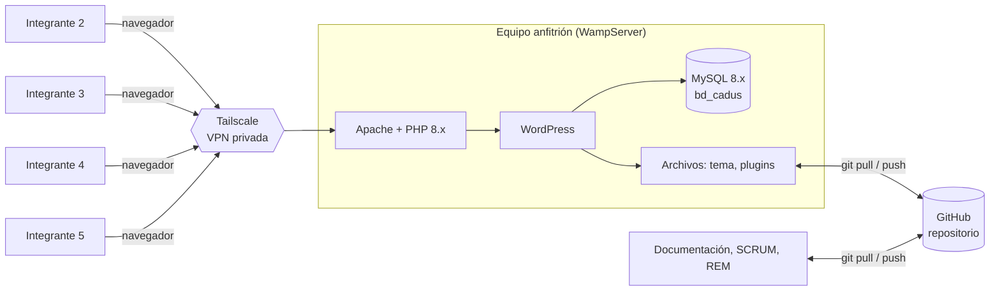

# Entorno de trabajo del equipo

Este documento describe cómo trabajamos los 5 integrantes sobre el portal CADUS. Recoge las restricciones [RC-01 y RC-02](../requisitos/rem-remus/REM-CADUS.md#6-restricciones-del-proyecto-rc-01-a-rc-02) de la especificación REM/REMUS.

## Visión general

## Qué va a cada sitio

| Qué | Dónde vive | Cómo se comparte |
|---|---|---|
| Contenido y ajustes hechos desde el panel de WordPress (páginas, entradas, menús, Editor del sitio, Personalizar, ajustes de plugins) | Base de datos `bd_cadus` en el servidor compartido | Se ve al instante: todos editan la misma instancia vía Tailscale |
| Archivos del tema y de plugins propios | Carpeta `cms-wordpress/wp-content/` del equipo anfitrión | GitHub (`git add`, `commit`, `push`) |
| Documentación, SCRUM, REM/REMUS, maquetas, diagramas | Repositorio | GitHub |
| Copia de seguridad de la base de datos | `cms-wordpress/backup-db/` | GitHub, solo como copia de seguridad y para la entrega |
| `wp-config.php`, `wp-content/uploads/`, credenciales | Solo en el equipo anfitrión | No se versionan |

## Cómo conectarse (integrantes que no son el anfitrión)

1. Instalar **Tailscale** desde tailscale.com/download e iniciar sesión con tu cuenta.
2. Aceptar la invitación para compartir el equipo anfitrión (te la envía quien lo aloja).
3. Con Tailscale activo, abrir en el navegador:
   `http://<IP-TAILSCALE-DEL-ANFITRION>/proyecto_gsi/cms-wordpress/wp-login.php`
   (la IP, del tipo `100.x.y.z`, te la facilita quien aloja el servidor).
4. Entrar con tu usuario de WordPress. Cada integrante tiene su propia cuenta con rol Administrador; no se comparten cuentas.

## Reglas de trabajo

- **Cambios en WordPress desde el panel:** se hacen directamente en el servidor compartido. Avisar al equipo antes de tocar algo que afecte a todos (tema, plugins, estructura de menús).
- **Cambios en archivos del tema o de plugins:** se hacen en la carpeta del equipo anfitrión y los sube a GitHub su propietario, o bien se trabaja en una copia local y se hace `push` para que el anfitrión haga `git pull`.
- **Antes de un cambio grande:** exportar un volcado de `bd_cadus` (ver [guía de la BD](../../cms-wordpress/backup-db/README.md)).
- **Commits:** mensajes con la convención del README (`feat:`, `fix:`, `docs:`, `chore:`). Hacer `git pull` antes de empezar a trabajar.
- **Seguridad:** no abrir el puerto de MySQL, no usar la opción "Poner en línea" de Wamp, usar contraseñas fuertes y no compartir `wp-config.php`.

## Limitaciones conocidas

- El servidor solo está disponible mientras el equipo anfitrión esté encendido, con Wamp en marcha y sin suspender.
- Todos dependen de la conexión del anfitrión; si falla, se trabaja en documentación y SCRUM y se retoma WordPress cuando vuelva.
- Un error en el servidor compartido (p. ej. un plugin defectuoso) afecta a todos a la vez; de ahí la importancia de las copias de seguridad de la BD.
